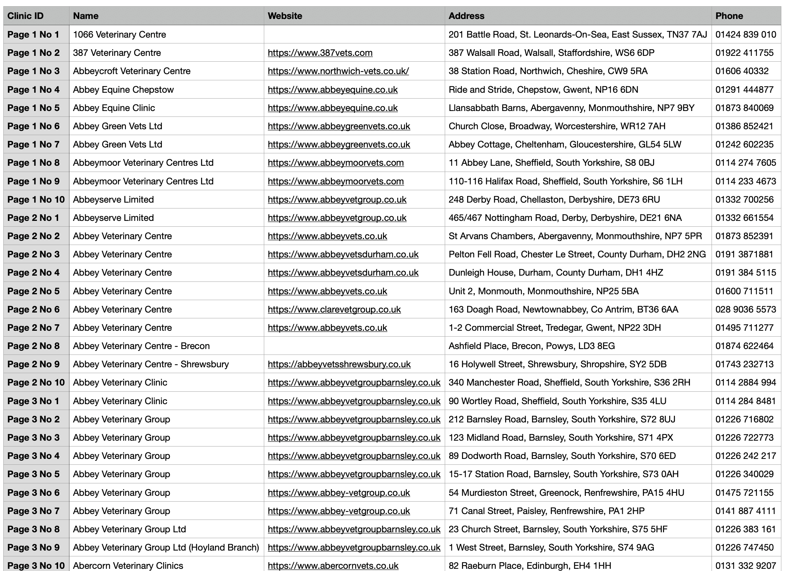

# Extract RCVS Website Data

This Python script is used to scrape data from the RCVS (Royal College of Veterinary Surgeons) <a href="https://findavet.rcvs.org.uk/find-a-vet-practice/?filter-choice=name&filter-keyword=&filter-searchtype=practice&filter-pss=true&p=1" target="_blank">website</a>. It retrieves information about veterinary practices, including the clinic ID, name, website URL, address, and phone number in UK.

## How to Run

1. Make sure you have Python installed on your machine. You can download Python from the <a href="https://www.python.org/downloads/" target="_blank">Python's official website</a>.

2. Install the required Python libraries by running the following command in your terminal:

```bash
pip install requests beautifulsoup4
```

3. Run the script by typing the following command in your terminal:

```bash
python extract_rcvs.py
```

## User Prompts

When you run the script, it will ask you for the following inputs:

- Start page: The page number to start scraping data from.
- End page: The page number to stop scraping data at.
- Save to CSV: Press `y` if you want to save the data to a CSV. You will be prompted to enter the name of the CSV file. It will ask for overwrite confirmation if the file already exists.

## Demo

### You can save the data to a CSV file or just view it in terminal


### The CSV file will be saved in the same directory as the script



## Data

The script retrieves the following data for each veterinary practice:

- Clinic ID: A unique identifier for the clinic, based on the page number and the order of the clinic on the page.
- Name: The name of the clinic.
- Website URL: The URL of the clinic's website.
- Address: The address of the clinic.
- Phone: The phone number of the clinic.

The data can be viewed in terminal and saved to a CSV file, depending on your input.
